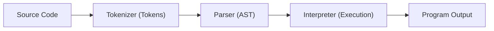

# SPEEK Interpreter

A modular, SOLID-based interpreter for the SPEEK scripting language.

## � Project Structure

The codebase is organized into logical packages to separate concerns:

- **`src/tokenizer`**: Converts raw source code into a stream of `Token` objects.
- **`src/parser`**: Transforms tokens into an Abstract Syntax Tree (AST).
- **`src/ast`**: Defines the nodes of the AST (Expressions, Numbers, Variables).
- **`src/instructions`**: Implements the execution behavior for each statement type.
- **`src/environment`**: Manages variable state and scope using generics.
- **`src/interpreter`**: The core execution engine that runs the parsed instructions.

## 🛠 How to Run

### 1. Compile the Project
Compile all Java files into the `bin` directory:
```bash
javac -d bin src/Main.java src/ast/*.java src/environment/*.java src/instructions/*.java src/interpreter/*.java src/parser/*.java src/tokenizer/*.java
```

### 2. Execute a SPEEK Script
Run the interpreter by providing the path to a `.speek` file:
```bash
java -cp bin Main examples/if_else_test.speek
```

## � Language Reference

| Feature | Syntax | Example |
| :--- | :--- | :--- |
| **Variables** | `let <name> be <expr>` | `let x be 10` |
| **Printing** | `say <expr>` | `say "Hello " + x` |
| **Conditionals** | `if <cond> then` | `if x is greater than 5 then` |
| **Loops** | `repeat <n> times` | `repeat 3 times` |
| **Operators** | `+`, `-`, `*`, `/`, `==` | `say 10 * 2` |

## 📐 Indentation Requirement

In SPEEK, blocks of code (inside `if` or `repeat`) **must be indented**. The interpreter uses column-based detection to identify the end of a block.

```speek
if score is greater than 50 then
    say "Pass"   # Indented (in block)
say "Finished"   # Column 0 (outside block)
```

## ⚙️ Pipeline Overview

The interpreter processes code in a sequential pipeline:



1. **Tokenizer**: Breaks text into words/symbols with line and column info.
2. **Parser**: validates syntax and builds a tree of instructions.
3. **Interpreter**: Traverses the tree and modifies the **Environment** state.

## 🎁 Bonus Features

- **If-Else Support**: Full `if-then-else` blocks are supported.
- **Equality Operator**: Supports the `==` operator for direct value comparison.
- **Generics**: The `Environment<T>` implementation uses Java Generics for type-safe variable handling.
